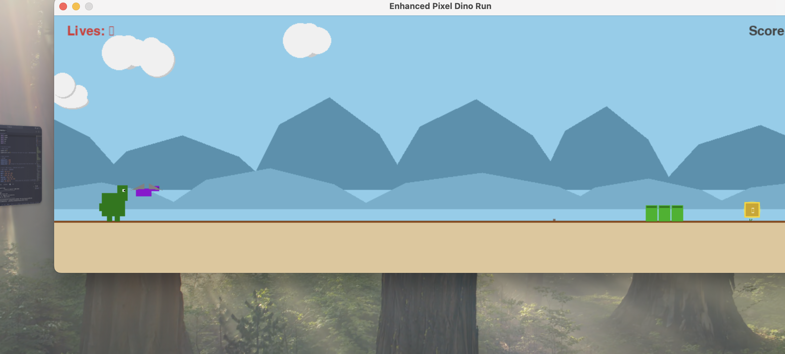

# Enhanced Pixel Dino Run / 像素恐龙跑酷加强版



This is an enhanced version of the classic Chrome Dinosaur game, built with Python and Pygame. This project was developed as a final course assignment for my Python programming class, featuring pixel art style graphics (simulated), dynamic backgrounds, power-ups, and bilingual (English/Chinese) language support.

这是一款使用 Python 和 Pygame 构建的经典 Chrome 小恐龙游戏的加强版。本项目是我 Python 编程课程的结课作业，它拥有像素艺术风格的图形（模拟实现）、动态背景、道具系统以及中英双语支持。

---

## Features / 主要特性

* **Enhanced Gameplay / 玩法增强:** Classic dino run with added features like fireball shooting, multiple power-ups (extra life, invincibility, score boost), and multiple lives.
    经典小恐龙跑酷，增加了发射火球、多种道具（额外生命、短暂无敌、额外分数）和多条生命等机制。
* **Pixel Art Aesthetics / 像素艺术美感:** Dinosaur, obstacles, and power-ups are designed with a pixel art feel using Pygame's drawing functions, with a structure allowing for easy replacement with sprite images.
    恐龙、障碍物、道具使用 Pygame 的绘图函数实现了像素艺术感，其代码结构便于后续替换为精灵图。
* **Dynamic Animations & Effects / 动态动画与效果:**
    * Player animations for running, jumping, ducking, and taking damage.
        玩家角色的跑、跳、蹲、受伤动画。
    * Pterodactyl flight animation.
        翼龙飞行动画。
    * Particle effects for fireball explosions and power-up pickups.
        火球爆炸和道具拾取的粒子效果。
* **Rich & Dynamic Background / 丰富动态的背景:**
    * Multi-layered parallax scrolling for depth (far hills, mid hills, ground decorations).
        多层视差滚动（远山、近山、地面装饰物）营造深度感。
    * Smooth day/night cycle affecting sky and ambient lighting.
        平滑的日夜交替效果，影响天空和环境光照。
    * Dynamic clouds and scrolling ground details.
        动态云朵和滚动的地面细节。
* **Sound & Music / 音效与音乐:** Integrated audio manager for various sound effects (jump, shoot, hit, power-up, game over, etc.) and looping background music. (Requires user-provided audio files).
    集成音频管理器，支持多种音效（跳跃、射击、碰撞、道具、游戏结束等）和循环背景音乐（需用户提供音频文件）。
* **Comprehensive UI / 完整用户界面:** Clear display for score, high score, lives, invincibility timer, on-screen control instructions (initially), pause screen, and game over screen.
    清晰显示得分、最高分、生命值、无敌倒计时、初始操作说明、暂停界面和游戏结束界面。
* **Bilingual Support (English/Chinese) / 双语支持 (中/英):** Real-time language switching for all in-game text and UI elements by pressing the 'L' key.
    支持通过按 'L' 键实时切换游戏内所有显示文本和界面元素的语言。
* **Persistent High Score / 持久化最高分:** Saves and loads the high score locally via `highscore.txt`.
    最高分会记录在本地文件 `highscore.txt` 中。

---

## Setup and Running / 配置与运行

**1. Prerequisites / 环境要求:**
* Python 3 (Python 3.7 or higher recommended / 推荐 Python 3.7 或更高版本)
* Pygame library

**2. Installation / 依赖安装:**
    Open your terminal or command prompt and run:
    打开终端或命令行，运行：
    ```bash
    pip install pygame
    ```
    *(If you are using a virtual environment, make sure it's activated. / 如果你正在使用虚拟环境，请确保已激活。)*

**3. Asset Files / 资源文件:**
    For the best experience, especially for custom fonts and audio, create the following directory structure within your project folder (e.g., `python_code`) and place the corresponding asset files. The game will attempt to create these directories if they don't exist, but you'll need to provide the actual content.
    为了获得最佳的游戏体验（特别是自定义字体和音效），请在你的项目文件夹 (例如 `python_code`) 下创建以下目录结构，并放入相应的资源文件。游戏会尝试创建这些目录（如果不存在），但你需要提供实际的文件内容。
    ```
    your_project_root_directory/
    ├── assets/
    │   ├── fonts/
    │   │   ├── PressStart2P-Regular.ttf  (Pixel font for English text / 英文像素字体)
    │   │   └── Microsoft_YaHei_Bold.ttf  (Or your chosen Chinese font / 或你选择的中文字体, e.g., MaShanZheng-Regular.ttf)
    │   ├── music/
    │   │   └── background_lemon.mp3      (Background music file / 背景音乐文件)
    │   └── sounds/
    │       ├── jump.mp3                  (Or .wav / 或 .wav 格式)
    │       ├── land.mp3
    │       ├── duck.mp3
    │       ├── fireball.mp3
    │       ├── hit.mp3
    │       ├── powerup.mp3
    │       ├── destroy.mp3
    │       ├── game_over.mp3
    │       └── pause.mp3
    │       └── (and other sound effect files as needed / 以及其他需要的音效文件)
    └── final_project5.py                 (Your game script / 你的游戏脚本)
    └── highscore.txt                     (Will be created/updated automatically / 游戏会自动创建和更新)
    ```
    * **Fonts / 字体：** The game attempts to load `PressStart2P-Regular.ttf` for English and a user-specified Chinese font (defaulted to `Microsoft_YaHei_Bold.ttf` in code, **you should replace this with your actual CJK font file name in `Game.__init__` or ensure this file exists**). If not found, it falls back to system defaults, which may affect the visual style. / 游戏会尝试加载 `PressStart2P-Regular.ttf` (英文) 和一个用户指定的中文字体 (代码中默认为 `Microsoft_YaHei_Bold.ttf`，**你应该在 `Game.__init__` 中将其替换为你实际使用的中文字体文件名，或确保此文件存在**)。如果找不到，会回退到系统默认字体，这可能会影响视觉风格。
    * **Audio / 音频：** If audio files are not found, the corresponding sound effects or music will not play (warnings will be printed to the console). / 如果找不到音频文件，对应的音效或音乐将不会播放（控制台会打印警告信息）。

**4. How to Run / 如何运行:**
    Navigate to the directory containing `final_project5.py` in your terminal and run:
    在终端中，导航到包含 `final_project5.py` 文件的目录，然后运行：
    ```bash
    python final_project5.py
    ```

---

## Controls / 按键操作

* **Jump / 跳跃:** `Spacebar` or `Up Arrow (↑)`
* **Duck / 下蹲:** `Down Arrow (↓)` or `S` key (hold to stay ducked / 按住以保持下蹲)
* **Shoot Fireball / 发射火球:** `X` key
* **Pause/Resume / 暂停/继续:** `P` key
* **Restart (after game over) / 重新开始 (游戏结束后):** `R` key
* **Toggle Language (EN/ZH) / 切换语言 (中/英):** `L` key

---

## Technical Summary / 技术总结

The game is developed using Python and the Pygame library, employing an object-oriented programming (OOP) approach. Key classes include `Game` (main controller), `Dinosaur` (player), `Obstacle` (with subclasses `Cactus`, `Pterodactyl`), `Fireball`, `PowerUp`, `Background`, `AudioManager`, `ParticleSystem`, and a global `LocalizationManager` for text.
游戏使用 Python 和 Pygame 库开发，采用了面向对象的编程范式。主要类包括 `Game` (主控制器)、`Dinosaur` (玩家)、`Obstacle` (及其子类 `Cactus`, `Pterodactyl`)、`Fireball`、`PowerUp`、`Background`、`AudioManager`、`ParticleSystem` 以及一个全局的 `LocalizationManager` (负责文本)。

It features a main game loop handling events, state updates (physics, collisions, spawning), and rendering. The background system includes parallax scrolling and a day/night cycle. Audio and particle effects enhance the user experience. Language localization allows for real-time switching between English and Chinese UI text.
游戏主循环负责处理事件、更新状态（物理、碰撞、生成逻辑）和渲染。背景系统包含视差滚动和日夜循环。音效和粒子效果增强了用户体验。语言本地化功能允许实时切换中英文界面文本。

---

## Future Optimizations & Enhancements / 后续优化与展望

While the game is functional and feature-rich, the following areas could be targeted for future improvements:
虽然游戏功能已相对丰富，但以下方面可以作为未来的改进方向：

* **Performance / 性能优化:**
    * **Image Asset Conversion:** If replacing `pygame.draw` with image sprites, use `image.convert()` and `image.convert_alpha()` for optimal blitting. / 如果将 `pygame.draw` 替换为图片精灵，请对加载的图片使用 `image.convert()` 和 `image.convert_alpha()` 以优化绘制速度。
    * **Sprite Sheets:** Consolidate animation frames into sprite sheets. / 将动画帧合并到精灵图表。
    * **Object Pooling:** For frequently created/destroyed objects like fireballs and particles. / 对火球、粒子等频繁创建/销毁的对象使用对象池。
    * **Pygame Sprites and Groups:** Consider refactoring game entities to use `pygame.sprite.Sprite` and `pygame.sprite.Group` for potentially more efficient management. / 考虑将游戏实体类重构为使用 `pygame.sprite.Sprite` 和 `pygame.sprite.Group` 以进行可能更高效的管理。
* **Visuals / 视觉效果:**
    * **Dedicated Pixel Art Sprites:** Replace current `pygame.draw` based visuals with actual pixel art image files for a more polished and consistent aesthetic. / 用真实的像素艺术图片文件替换当前基于 `pygame.draw` 的视觉元素，以获得更精致和统一的美感。
    * **More Animations:** Add more detailed animations for various game events. / 为各种游戏事件添加更细致的动画。
* **Gameplay / 游戏性:**
    * **More Variety:** Introduce new types of obstacles, power-ups, or even boss encounters. / 引入更多类型的障碍物、道具，甚至Boss战。
    * **Difficulty Scaling:** Implement more nuanced difficulty adjustments beyond just speed increase. / 实现比单纯提高速度更细致的难度调整。

---

**Note / 备注:**
This project is submitted as a final assignment for my Python programming course. The initial structure and some enhanced features were developed with the assistance of AI (Claude), and subsequently refined, expanded, and localized by me.
本项目是我Python编程课程的结课作业。其初始结构和部分增强功能在AI（Claude）的辅助下开发完成，后续由我本人进行了细化、扩展和本地化处理。
